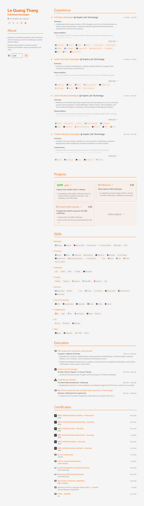

# Print-friendly portfolio/CV

Demo:

- My portfolio/CV - [lethang7794.github.io](https://lethang7794.github.io)



  

## ✨ Features

- One `cv.json` for both portfolio website and CV (PDF).
- Fully responsive website.
- Dynamically dark mode.
- Dynamically theme.
- Support print directly from browser.
- Builtin GitHub workflow to
  - generate PDF
  - deploy as GitHub Page

## 🛠️ Stack

- [**Astro**](https://astro.build/) - The next-gen web framework.
  - [**Astro Icon**](https://github.com/natemoo-re/astro-icon): Inline and sprite-based SVGs.
- [**Typescript**](https://www.typescriptlang.org/) - JavaScript with type syntax.
- [**Hotpadkey**](https://github.com/jesubohr/hotkeypad) - Dropdown menu with keyboard shortcuts made in pure JavaScript.

## 🚀 Getting Started

- This project uses [pnpm](https://pnpm.io/installation) as package manager.

  ```bash
  # Enable pnpm on MacOS, WSL & Linux
  corepack enable
  corepack prepare pnpm@latest --activate
  ```

### 1. Fork this repo

- [Fork](https://github.com/lethang7794/lethang7794.github.io) this repo then clone your fork.

- Or, use this repo as a template

  ```bash
  pnpm create astro@latest -- --template lethang7794/lethang7794.github.io
  ```

### 2. Add Your Content

- Edit the `cv.json` file to create your own printable Portfolio/CV.

### 3. Launch the Development Server

- Run `pnpm dev`

  ```bash
  pnpm dev
  ```

- Open [**http://localhost:4321**](http://localhost:4321/) in your browser to view the result 🚀

### 4. Customizable colors

- In `cv.json`
  - change `basics.theme` from `default` to one of the value of: `red`, `blue`, `green`, `cyber` and `default`.

> [!TIP]
> These values `red`, `blue`, `green`, `cyber` are of the `data-theme` attribute in [`theme.css`](https://github.com/lethang7794/lethang7794.github.io/blob/main/public/themes/themes.css).

> [!NOTE]
> You can create your own custom themes by adding your own css to [`theme.css`](https://github.com/lethang7794/lethang7794.github.io/blob/main/public/themes/themes.css).

## 🧞 Commands

|     | Command         | Action                                                         |
| :-- | :-------------- | :------------------------------------------------------------- |
| ⚙️  | `dev` o `start` | Launches a local development server at `localhost:4321`.       |
| ⚙️  | `build`         | Checks for errors and creates a production build in `./dist/`. |
| ⚙️  | `preview`       | Local preview at `localhost:4321`                              |

## More information

- `cv.json` is based on `jsonresume` schema from [**jsonresume.org**](https://jsonresume.org/schema/)

## Credits

- [**Bartosz Jarocki - Print-friendly, minimalist CV page**](https://github.com/BartoszJarocki/cv)
- [**Miguel Ángel Durán - minimalist-portfolio-json**](https://github.com/midudev/minimalist-portfolio-json)
- [**Smilesharks - dev-portfolio**](https://github.com/Smilesharks/dev-portfolio)
- [**jesubohr - hotkeypad**](https://github.com/jesubohr/hotkeypad)
